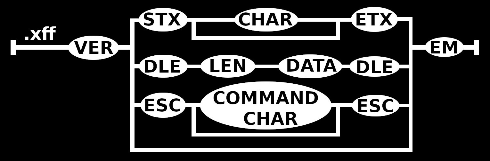
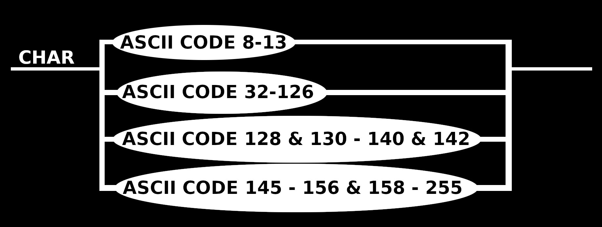

# Nabu

> [!warning]
> This is a hobby project. It is not intended to be used in production.

The overarching goal of this project is to create a library that can be used to build, read and write `.xff` files.
`.xff` files are going to be my attempt at a general purpose file format, with Nabu as a small wrapper around it, giving the opportunity for downstream projects to create their own files suiting their needs.

## `.xff` specification
`.xff` stands for `xqhares file format` or `xqhared file format`, pronounced `squares file format` or `squared file format`.
I have chosen ASCII encoding, specifically Windows-1252 as the data representation in binary. Mainly because I wanted to work with it.
As such, any mention of ASCII should be understood to be referring to Windows-1252 specifically.

`.xff` is a very simple format. It essentially uses a small subset of ASCII control characters to wrap arbitrary data.
If used with ASCII data only, it can hold any String, Number of Control characters.

### Command characters
`DLE`, or Data Link Escape is the ideal general escape character inside the chosen ASCII encoding. 
Any data following `DLE`, until another `DLE` is encountered, is considered part of the data-stream. This should make it possible to save any kind of data inside, be it media or documents.
Directly after the opening `DLE` are 8 bytes (64 bits) that indicate the length of the data, and then the data itself.
This makes the largest possible continuous strip of data 18.4 million terabytes.
The closing `DLE` is not part of the data, but it should be used to initiate a check of the length of the data and validate it.
The data inside the escape should be stored as-is, and should not be decoded (e.g. `Vec<u8>`), meaning that inside it could be UTF-8 encoded or JPEG encoded for example.
Here the burden to decode and encode the data lies on the downstream project.

`EM` is the end of the `.xff` file.

All command characters should be returned to the caller, and any non-command characters should error.
To make all characters available to the caller, any command character should be escaped with `ESC`, and `ESC` should be escaped with `ESC` too.
Command characters should be saved together, if they are followed by another command character, to save on escaping every single one.

> [!important]
> Because of the way I decided to design the `.xff` specification, the control characters, as they are called in the ASCII standard, are not all valid command characters.
> Some non control characters are also valid command characters.

### Strings and numbers
Strings and numbers have to be encoded in ASCII, or they have to be treated as any other escaped data.
The command character codes 8 through 13 are permissible without the need to be escaped.
An entry can be of any length.

`STX` and `ETX` are the start and end of any text data or numerical data encoded in ASCII.
The `ETX` shall also provide an inbuilt check of the length of the data to validate it.
The text wrapped by it should be returned as a fully decoded `String` or appropriate `Number`.
The difference between `String` and `Number` is that a valid `Number` is any valid number as according to `ECMA-404`, and any different content is a `String`.

