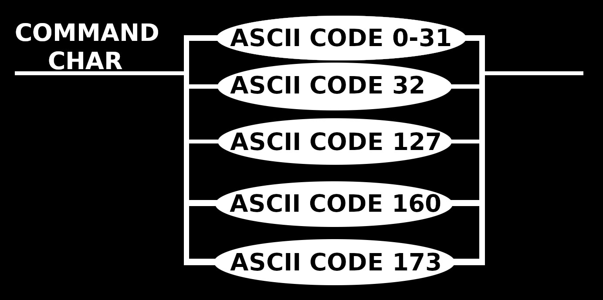

# `.xff` specification v0

> [!note]
> *Version 0 is the first "working" version.*

`.xff` stands for `xqhares file format` or `xqhared file format`, pronounced `squares file format` or `squared file format`.
Alternatively, it could be called `xtended file format` or `extended file format`.

The binary data in `.xff` is encoded in ASCII, specifically Windows-1252 and uses the Big-Endian byte-ordering.
Any mention of ASCII should be understood to be referring to Windows-1252 specifically. 
[See the reference table here.](ascii-reference.md)

`.xff` is a very simple format. It uses a small subset of ASCII control characters to wrap arbitrary or ASCII data.
If used with ASCII data only, it can hold any String, Number or Control character and any amount of them.
The `.xff` format has no set maximum file size.

A `.xff`file starts with one byte (8 bits) of data, encoding the current version of the `.xff` specification.
The version number starts at 0 and increases by 1 each time a new version is added.
Any implementation of this specification should be able to read any version of the specification, but may choose to only support a specific set of versions or version.

## Strings and numbers
Strings and numbers have to be encoded in ASCII, or they have to be treated like any other escaped data.
An entry can be of any length.

The command character codes 8 through 13 are permissible in a `String` without the need to be escaped.
No command characters should be used if a `Number` is represented.

`STX` and `ETX` are the start and end of any text data or numerical data encoded in ASCII.
The `ETX` also provides an inbuilt check of the length of the data to validate it.
The text wrapped by it should be returned as a fully decoded `String` or appropriate `Number`.
The difference between `String` and `Number` is in that a valid `Number` is any valid number as according to the 2nd Edition of `ECMA-404` from December 2017, and any different content is a `String`.

## Escaped general data
`DLE`, or Data Link Escape is the data escape character. 
Any data following `DLE`, until another `DLE` is encountered, is considered part of a unified data-stream. This makes it possible to save any kind of data inside.

Directly after the opening `DLE` are 5 bytes (36 bits) that encode the length of the data in bytes, followed by the data itself.
This makes the largest possible continuous strip of roughly 1 terabyte of data.
Any data-stream larger than that needs to be split up into several `DLE` enclosed data-streams.

The closing `DLE` is not part of the data, but it serves as a check of the length of the data to validate it.
The data inside the escape should be stored as-is, meaning that the data inside it could be UTF-8 encoded or JPEG encoded for example.

## Command characters
All command characters should be returned to the caller, and any non-command characters should error.
To make all characters available to the caller, any command character should be escaped with `ESC`, and `ESC` should be escaped with `ESC` too.
This requirement makes it so that the only way to encode a singular `ESC` is with `ESC` `ESC` `ESC` `ESC`. Using 4 byte to encode one byte of data. 
Command characters should be saved together, if they are followed by another command character.

`EM` is the end of the `.xff` file and serves as a check that the entire `.xff` file has been read.

> [!important]
> Because of the way I decided to design the `.xff` specification, the control characters, as they are called in the ASCII standard, are not all valid command characters.
> Some non control characters are also valid command characters.

