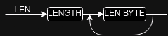
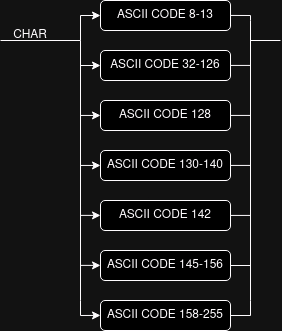
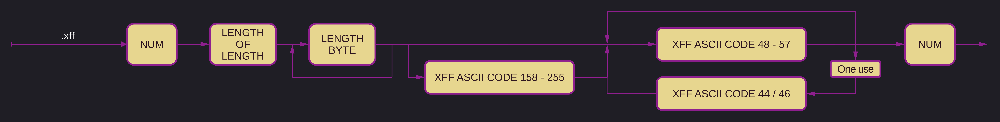
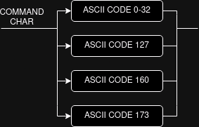
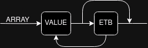
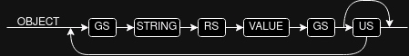
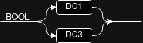

# `.xff` specification v1

> [!note]
> ***This version is not yet finalized.***

This specification differs significantly from version 0 and is this incompatible with it and any files created with it.

`.xff` stands for `xqhares file format` or `xqhared file format`, pronounced `squares file format` or `squared file format`.
Alternatively, it could be called `xtended file format` or `extended file format`.

The binary data in `.xff` is encoded in ASCII, specifically Windows-1252.
Any mention of ASCII should be understood to be referring to Windows-1252 specifically. 
[See the reference table here.](ascii-reference.md)

`.xff` is a simple format capable of holding any kind of data and any amount of it. It uses a small subset of ASCII control characters to wrap arbitrary or ASCII data.
The `.xff` format has no set maximum file size.

A `.xff`file starts with one byte (8 bits) of data, encoding the current version of the `.xff` specification.
The version number starts at 0 and increases by 1 each time a new version is added.
Any implementation of this specification should be able to read any version of the specification, but may choose to only support a specific set of versions or version.

This specification has defined eight value types that can be stored in the `.xff` file.
They are:

1. Strings
2. Numbers
3. General Data
4. Command characters
5. Arrays
6. Objects
7. Boolean's
8. Null

Any row wrapped by `VER` and `EM` in the diagram below is considered a single value.

    

        Click to expand a diagram showing the complete makeup of a `.xff` file
    

## Length attribute

Every value type except `Booleans` and `Null` has a length attribute.

The length attribute is split in two parts:
First the byte length of the length, then as many bytes as indicated by the first byte containing the length.

If for example the first byte is set to one, the length is the following byte.
Should the first byte be four, the length is encoded in the following four bytes.

The first byte may never be 0.

All length data is encoded in binary using the Little-Endian byte-ordering, and always refers to the length in bytes of the following data.

> [!note]
> This means that the largest possible length is a number 255 bytes long. 1.2e614 if my math is right. That is larger than there are atoms in the observable universe, by about 7.6 times!
> With an 8 byte long number you can already save 1 petabyte of data, so it should be fine for at least the next few years.

## Strings

The general makeup of a `String` is the same as in version 0.

Strings have to be encoded in ASCII.

The command character codes 8 through 13 are permissible in a `String` without the need to be escaped.

`STX` and `ETX` are the start and end of any text data or numerical data encoded in ASCII.
The `ETX` also provides an inbuilt check of the length of the data to validate it.
The text wrapped by it should be returned as a fully decoded `String`.

## Numbers

The makeup of a `Number` differs from version 0. In version 0 any number was valid as defined in `ECMA-404`.

In version 1 any valid `Number` is now defined as a sequence of decimal digits (`0` to `9`) with no superfluous leading zero. It may contain a single `.` or `,` separator between the digits.
This specification allows implementations to set limits on the range and precision of numbers accepted.
It is to be expected however that 64bit numbers should be enough for the foreseeable future.

Any number that does not fit these criteria, is a `String`.
No command characters may be used if a `Number` is represented.
`NaN` and `Infinity` are not valid `Number`s.

The way `.` and `,` are to be interpreted is left to the implementation. It is recommended to use both `,` and `.` for decimal points.

Only one `.` or `,` is allowed in a `Number`.

A `-` may only be used as the first character, and only one `-` is allowed.

## General data

`.xff` files can contain any kind of data and make it easy to do so.

`DLE`, or Data Link Escape is the data escape character used to enclose the arbitrary data to be stored.
As with most other values, directly after the opening `DLE` are the length bytes that encode the length of the data in bytes, followed by the data itself.

Any data following `DLE`, until another `DLE` is encountered, is considered part of a unified data-stream.

The closing `DLE` is not part of the data, but it serves as a check of the length of the data to validate it.
The data inside the escape has to be stored as-is, meaning that the data inside it could be UTF-8 encoded or JPEG encoded for example.

## Command characters

To make all characters available to the caller, any command character should be escaped with `ESC`, and `ESC` should be escaped with `ESC` too.
All command characters wrapped in this way have to be returned to the caller, and any non-command characters wrapped in this way have to error.

This requirement makes it so that the only way to encode a singular `ESC` is with `ESC` `ESC` `ESC` `ESC`. Using 4 byte to encode one byte of data. 

Command characters should be saved together, if they are followed by another command character.

> [!important]
> Because of the way I decided to design the `.xff` specification, the control characters, as they are called in the ASCII standard, are not all valid command characters.
> Some non control characters are also valid command characters.

## Array

An array may consist of any number of values of any type.

The elements are separated by `ETB`.

The array may be closed with a trailing `ETB` or without.

## Object

An object may consist of any number of key-value pairs.

The keys have to be strings, the values can be any type.

The elements are enclosed by `GS`, the key and the value are separated by `RS`.
The key-value pairs are separated by `US`.

The object may be closed with a trailing `US` or without.

## Boolean

A boolean can be either `true` or `false`.
Represented by the ASCII control characters `DC1` and `DC3`, or `XON` and `XOFF` respectively.

## Nul / Null / None

A null value can be represented by the ASCII control character `NUL`.

## End of file

`EM` is the end of the `.xff` file and serves as a check that the entire `.xff` file has been read.

---

    

        V1 Discussion - for prosperity
    

## Musings about a future version 1

- Make a custom byte map?

- Make Numbers their own value? Maybe?
    - Save scientific notation as Strings so that we do not lose precision for extreme numbers like in v0.
- A way to represent arrays of data in byte form directly in `.xff` would be nice.
    - I am continuously running into the need to at least be able to store key-value pairs in `.xff` files.
- Some kind of optional metadata for any data, be it strings, data or even command characters.
- Maybe integrate an object store directly, solving all of the above?
- Think about what to do with features, implement version dependent read and write functions?
- Everything gets a length attribute. For performance.
    - Variable amount of length-bytes by prepending a single byte encoding the length of the length-bytes. Maximum length possible: 1.2E614 bytes - Length of a Petabyte: 1e15 which needs only 8 bytes.

## Note for version 255 - move to v2 when v1 done
- Add a second version byte to the start of the file, easy 256 more versions right there!
    - Fuck it, 2 more version bytes for 65.536 more versions! If I ever reach 255 I'll need them!
