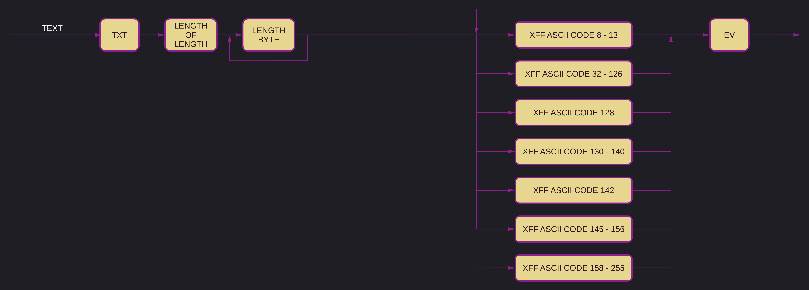
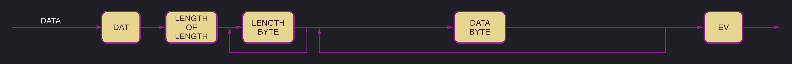
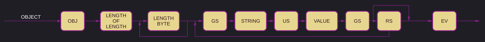
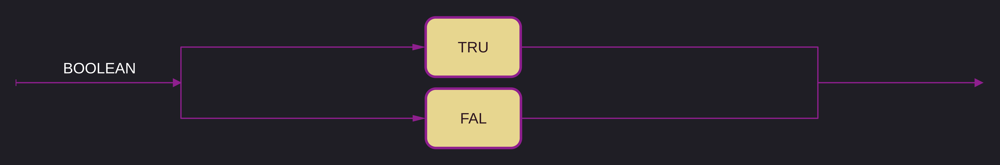

# `.xff` specification v1

> [!note]
> ***This version is not yet finalized.***

Version 1 has evolved the `.xff` specification from a very simple, to a more complex format closer to JSON in its capabilities.

This specification differs significantly from version 0 and is this incompatible with it and any files created using it.

`.xff` stands for `xqhares file format` or `xqhared file format`, pronounced `squares file format` or `squared file format`.
Alternatively, it could be called `xtended file format` or `extended file format`.

The binary data in `.xff` is encoded in a custom subset of [ASCII](xff-byte-encoding.md), specifically of Windows-1252.
Any mention of [ASCII](xff-byte-encoding.md) is to be understood to be referring to [this](xff-byte-encoding.md) subset specifically. 

`.xff` is a simple format capable of holding any kind of data and practically any amount of it (any-one value tops out at 1.2e614 bytes - that is 7.6 times more bytes than there are atoms in the universe). It uses a small subset of [ASCII](xff-byte-encoding.md) command characters to wrap data.
The `.xff` format has no maximum file size.

Every `.xff` file starts with one byte (8 bits) encoding the current version of the `.xff` specification.
The version number starts at 0 and increases by 1 each time a new version is added.
Any implementation of the `.xff` specification should be able to read any version of the specification, but may choose to only support any set of versions or version.

In this specification seven value types have been defined that can be stored in a `.xff` file.

They are:

1. Strings
2. Numbers
3. Data
4. Arrays
5. Objects
6. Boolean's
7. Null

Any row wrapped by `VER` and `EM` in the diagram below is considered a single value.

## Length attribute

Every value type has a length attribute except for `Booleans` and `Null`.

The length attribute is split in two parts:
First the byte length of the length, then as many bytes as indicated by the first byte containing the length.

If for example the first byte is set to one, the length is the following byte.
Should the first byte be four, the length is encoded in the following four bytes.

The first byte may never be 0.

All length data is encoded in binary using the Little-Endian byte-ordering, and always refers to the length in bytes of the following data.

> [!note]
> This means that the largest possible length is a number 255 bytes long. 1.2e614 if my math is right. That is larger than there are atoms in the observable universe, by about 7.6 times!
> With an 8 byte long number you can already save 1 petabyte of data, so it should be fine for at least the next few years.

## Strings

The general makeup of a `String` is the same as in version 0.

Strings have to be encoded in [ASCII](xff-byte-encoding.md).

The command character codes 8 through 13 are permissible in a `String`.

`TXT` is the start and end of any text encoded in [ASCII](xff-byte-encoding.md).
The trailing `TXT` provides an additional check of the length of the data to validate it.

## Numbers

The makeup of a `Number` differs from version 0. In version 0 any number was valid as defined in `ECMA-404`.

In version 1 any valid `Number` is now defined as a sequence of decimal digits (`0` to `9`) with no superfluous leading zero. It may contain a single `.` or `,` separator between digits.
This specification allows implementations to set arbitrary limits on the range and precision of numbers accepted, but it recommends 64bit numbers.

No command characters may be used.
`NaN` and `Infinity` are not a valid `Number`.

The way '`.`' and '`,`' are to be interpreted is left to the implementation. Both '`.`' and '`,`' are to be used to represent decimal points.
Only one '`.`' or '`,`' is allowed in a `Number`.

A '`-`' (minus sign) may only be used as the first character, and only one '`-`' is allowed.
The presence of a '`-`' marks the number as negative.

## Data

`.xff` files can store arbitrary data by wrapping it in `DLE`, or Data Link Escape along with its length.

All data enclosed by `DLE` is considered one unified data-stream that is stored as-is and may not be changed in any way.

The closing `DLE` serves as another check of the length of the data.
The data inside the escape is stored as-is, meaning that the data inside it could be UTF-8 encoded or JPEG encoded for example.

## Array

An array may consist of any number of values of any type. Its length is limited to 1.2e614 bytes.

The elements are separated by `ETB`.

The array may be closed with a trailing `ETB` or without.

## Object

An object may consist of any number of key-value pairs.

The keys have to be `Strings`, the values are of any type.

The pairs are enclosed by `GS`, the key and the value are separated by `US`.
The key-value pairs are separated by `RS`.

The object may be closed with a trailing `RS` or without.

## Boolean

A boolean can be either `true` or `false` and is represented by `TRU` and `FAL` respectively.

## Nul / Null / None

A null value is represented by the command character `NUL`.

## End of file

`EM` is the end of the `.xff` file and serves as a check that the entire `.xff` file has been read.

---

    

        V1 Discussion - for prosperity
    

## Musings about a future version 1

- Make a custom byte map?

- Make Numbers their own value? Maybe?
    - Save scientific notation as Strings so that we do not lose precision for extreme numbers like in v0.
- A way to represent arrays of data in byte form directly in `.xff` would be nice.
    - I am continuously running into the need to at least be able to store key-value pairs in `.xff` files.
- Some kind of optional metadata for any data, be it strings, data or even command characters.
- Maybe integrate an object store directly, solving all of the above?
- Think about what to do with features, implement version dependent read and write functions?
- Everything gets a length attribute. For performance.
    - Variable amount of length-bytes by prepending a single byte encoding the length of the length-bytes. Maximum length possible: 1.2E614 bytes - Length of a Petabyte: 1e15 which needs only 8 bytes.

