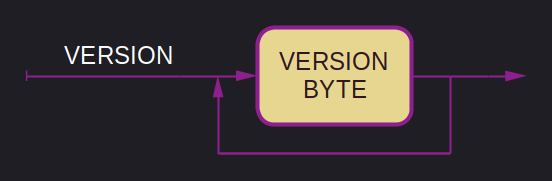
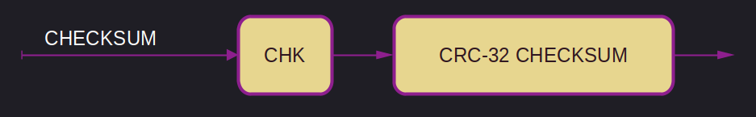
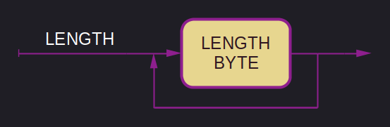
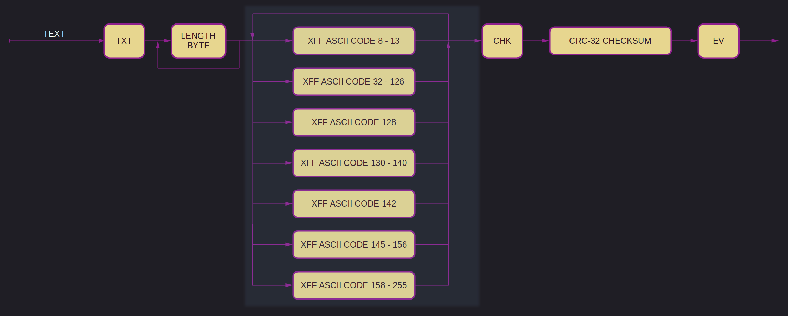
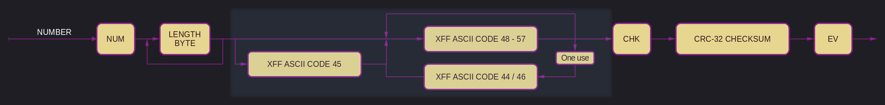
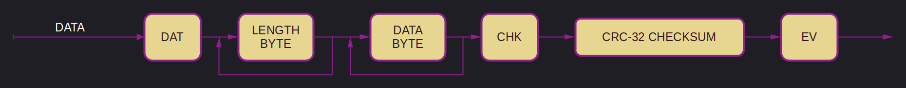
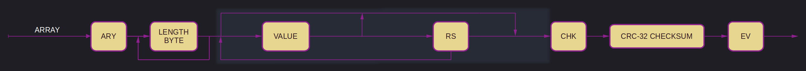
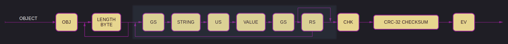
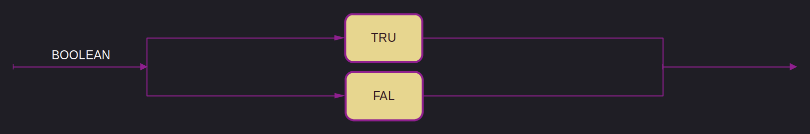
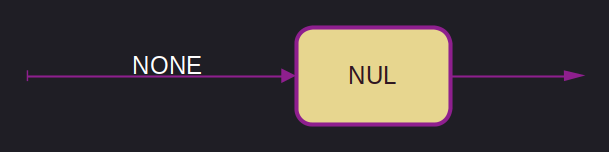

# `.xff` specification v2

> [!note]
> ***This version is not yet finalized.***

Started work on 2025-03-15

--- --- --- ---

Version 2 is a small extension of version 1. A version 2 Parser can be constructed to parse version 1 as well.
It is still akin to a binary JSON variation capable of storing arbitrary data.

While this version of the `.xff` specification is designed to be compatible with version 1, the implementation of this compatibility is not required by any Implementor of this specification, but strictly optional.

Version 2 uses more space than version 1, this is because of the addition of checksums.
Every value has increased by 4 bytes in size, and the overall structure increased by 5 bytes.

`.xff` stands for `xqhares file format` or `xqhared file format`, pronounced `squares file format` or `squared file format`.

The binary data in `.xff` is encoded in a custom [ASCII](xff-byte-encoding.md) variation, using Windows-1252 as its base.
Any mention of [ASCII](xff-byte-encoding.md) is to be understood to be referring to [this](xff-byte-encoding.md) subset specifically. 
In contrast to version 1, one new entry is added to the [ASCII](xff-byte-encoding.md) character set: `0x17` as `CHK` - Checksum.

`.xff` is capable of holding any kind of data and any amount of it.
The `.xff` format itself has no maximum file size.

The version encoding has changed, but remains backwards compatible with version 0 and 1. [More here.](#version-encoding)
Any implementation of the `.xff` specification should be able to read all versions of the specification, but may choose to only support any set of versions or a single version.

A `.xff` file can store seven value types:

1. [Strings](#strings)
2. [Numbers](#numbers)
3. [Data](#data)
4. [Arrays](#array)
5. [Objects](#object)
6. [Boolean's](#boolean)
7. [Null](#null)

All values are delimited with a `EV`.

A `.xff` file may never contain zero values.

The diagram below shows the entire composition of a `.xff` file, including the length attribute, version encoding and checksum.

## Version Encoding
The version encoding has changed from the previous two versions, but remains backwards compatible with version 0 and 1.

The version is encoded not as a binary number, but as a chain of bits.
The order of the bits is in from least significant to most significant, not as a series of bits starting with the very first bit.
The first bit is always part of the version, thus 0 is an acceptable bit and denotes version 0.

The way the version is encoded is similar to the way the length is encoded in LEB128.
Just as in LEB128, the encoding is variable length and the most significant bit is used as a `continuation bit`.
In contrast to LEB128, all bits set to 1 are added together to form the version.

The last version byte is always padded to a full width byte with 0s.

| Hex | Binary | Version |
| -------------- | -------------- | --------------- |
| 00 | 0000 0000 | 0 |
| 01 | 0000 0001 | 1 |
| 03 | 0000 0011 | 2 |
| 07 | 0000 0111 | 3 |
| 0F | 0000 1111 | 4 |

> [!note]
> Instead of parsing the binary data, a simple Hex matching may suffice.

## Checksum
To increase security, as well as to make corruptions more easily detectable, this version of the `.xff` format uses checksums.
Every value type has a checksum except for `Booleans` and `Null`.

The checksum is a 32-bit unsigned integer and is calculated by using the CRC-32 algorithm.
The checksum is always 4 bytes long.
A checksum is delimited from the value by a `CHK` marker.
The `CHK` marker must appear before the checksum itself.

The checksum of single values is not part of the length field of the value it checks.
It is calculated by using the actual data of the value, not including the length field, but including the markers used in `Array` and `Object`.

The checksum of the entire file is calculated over the entire file, excluding only the version byte, the `CHK` marker of the file checksum, and the `EM` marker.

## Length attribute
Every value type has a length except for `Booleans` and `Null`.

The way length is encoded has changed drastically form version 1. While still being variable length encoding, it now uses LEB128 encoding of an unsigned integer.

This means that the most significant bit is reserved as a `continuation bit` and if set to 1, the next byte continues the length encoding.

The first byte may be 0 for zero length arrays and objects.
All length data is encoded in binary using the Little-Endian byte-ordering, and always refers to the length in bytes of the following data.

## Strings

The makeup of a `String` is the same as in version 0.

Strings have to be encoded in [ASCII](xff-byte-encoding.md).

Command character codes 8 through 13 are permissible in a `String`.

`TXT` is the start and end of any text encoded in [ASCII](xff-byte-encoding.md).
The trailing `EV` provides an additional check of the length of the data to validate it.

## Numbers

The makeup of a `Number` differs completely from version 0.

Version 1 defines a valid `Number` as a sequence of decimal digits (`0` to `9`) with no superfluous leading zero, containing a single `.` or `,` decimal separator between digits.

'`.`' and '`,`' represent a decimal point.
Only one '`.`' or '`,`' is allowed per `Number`.

A '`-`' (minus sign) may only be used as the first character, and only one '`-`' is allowed.
The presence of a '`-`' marks the number as negative.

`NaN` and `Infinity` are not a valid `Number`.

No command characters may be used.

This specification allows implementations to set arbitrary limits on the range and precision of numbers accepted, but it recommends the implementation of IEEE 754 binary64.

A number is opened with `NUM`, followed by the length of the number in bytes, followed by the number itself. It is closed by a `EV` byte.

## Data

`.xff` files can store arbitrary data by wrapping it in `DAT`, along with its length.

All data enclosed by `DAT` is considered one unified data-stream that is stored as-is and may not be changed in any way.

The closing `EV` serves as another check of the length of the data.

## Array

An array may consist of any number of values of any type. The total length of all elements is limited to 1.2e614 bytes.

Arrays may contain more arrays with no limit set on the amount of nesting.

To open an array, `ARY` is used, followed by the length of the array in bytes, followed by the array itself. It is closed by `EV`.

The elements are separated by `RS`.

The array may be closed with a trailing `RS` or without.

## Object

An object may consist of any number of key-value pairs. One object has the theoretical maximum size of 1.2e614 bytes.

The keys have to be `Strings`, the values are of any type.

The keys are to be string-encoded as laid out [above](#strings).

Objects may contain more objects with no limit set on the amount of nesting.

To open an object, `OBJ` is used, followed by the length of the object in bytes, followed by the object itself. It is closed by `EV`.

The pairs are enclosed by `GS`, the key and the value are separated by `US`.
The key-value pairs are separated by `RS`.

The object may be closed with a trailing `RS` or without.

## Boolean

A boolean can be either `true` or `false`, represented by `TRU` and `FAL` respectively.

## Null

A null value is represented by `NUL`.

## End of file

`EM` is the end of the `.xff` file.

---

    

        V2 Musings - for prosperity
    

## Musings about a future version 2

### Adding a checksum
To increase the security, as well as to make corruptions more easily detectable, I propose to add a checksum to all data types.
`.xff` was always designed with data storage and transmission in mind. Even while designing version 1, I knew that ideally I would use a checksum.

The checksum is a 32-bit unsigned integer and is calculated by using the CRC-32 algorithm.
This means that the checksum will always be 4 bytes long.

There are two locations and scopes under consideration for the checksum:
1. Adding the checksum to all values, storing it before the `EV` marker.
2. Adding the checksum marker to the file entire file, and storing it before the `EM` marker.

The length of the checksum would not be part of the length field of the value itself.

#### Adding a checksum to all values
Any value that uses the `EV` marker will have the checksum added to it. This excludes all booleans and null.
The proposed location to store the checksum is following the data, but before the `EV` marker.
This checksum would only be calculated by using the actual data of the value, not the length field.

#### Adding a checksum marker to the file
I propose a second checksum, placed at the very end of the file and right in front of the `EM` marker.
This checksum would be calculated over the entire file, including the length field of all values with the only exception being the version encoding and the `EM` marker.

#### Adding a checksum marker
For ergonomics, I would like to add a marker for the checksum.
`0x17` would be the logical choice, as its unused and right in front of the `EV` marker at `0x18`.
I propose to call it `CHK` for checksum.

**ACK** - No-brainer.

### Reworking Length
The length field is needed, but only to decode the `Data` data type.
But there is the chance to rework the way the length is encoded, and make it more bespoke.
I would still want it to be variable length encoded though, to save space.

I do not want to dismiss the possibility of just using 8 bytes for the length always.

The most probable way of reworking length would be to implement LEB128.

**ACK** - Fuck it, we ball. I don't do things because they are easy, but because I think they will be easy!

### Changing the version encoding
Move from a single byte to a more bespoke format. In versions 0 and 1 the version byte is encoded as a single byte unsigned integer. I propose to change it to a chain of bits.

The first bit is always part of the version, thus 0 is an acceptable bit.

If the first bit of the file is 0, its version 0.

If the first bit of the file is 1 and the second bit is 0, its version 1.

If the first bit of the file is 1 and the second bit is 1, its version 2.

The main drawback is the reduction of possible versions representable in a single byte, down to 8.
8 Versions should still be more than enough, and adding on a new byte for version 9 onwards would be trivial with the right standard definition.

#### Reasoning
With removing the length field, I am loosing one of my bespoke features, and to be honest, I want at least one weird, funny or non-standard feature.
I find this incredibly funny for some reason, and I think it would be fun to implement.
Also, I want a reason to need to read single bits, instead of just bytes. Who knows, I might learn something or two!

#### Proposed version encoding standard
The version is encoded not as a binary number, but as a chain of bits.
The order of the bits is in from least significant to most significant, not as a series of bits starting with the very first bit.
The first bit is always part of the version, thus 0 is an acceptable bit and denotes version 0.
For every other versions, every occurrence of a 1 in the bit sequence is a new version.
Should all bits be 1, the next byte is read according to this scheme.
This continues until a bit is 0.

| Binary | Version |
| -------------- | --------------- |
| 0000 0000 | 0 |
| 0000 0001 | 1 |
| 0000 0011 | 2 |

**ACK** - I like it.

### Removing Length in favor of a checksum

The length field is not needed, since the file is self-delimiting. As nice as it was as a kind of verification of data integrity, it was always a lazy man's checksum.

There are two main drawbacks to removing the length field:
1. The minimum size in bytes doubles from 2 to 4.
2. You can no longer just read the length bytes and drain the appropriate number of bytes.

#### 1. The minimum size in bytes doubles from 2 to 4.
Not really a problem, we are talking bytes after all.

#### 2. You can no longer just read the length bytes and drain the appropriate number of bytes.
Again, not really a problem, the xff values are designed to be self-delimiting. But I do really like the ergonomics of it.
But this is my main problem with removing length straight out. It is a stupid and weird thing to do, but I have grown attached to it.

**NACK** - It's actually needed for deserializing the `Data` data-type.

